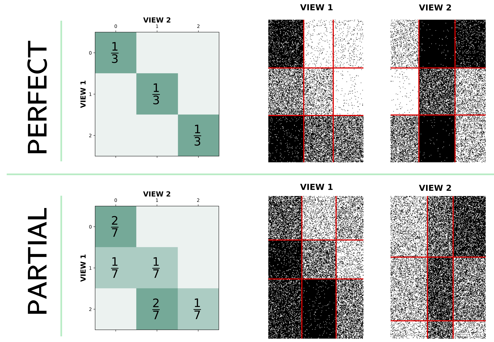

The Multi-View Latent BLock Model
========

An implementation of the Multi-View Latent Block Model (MVLBM) co-clustering method, presented in 'Co-Clustering Multi-View Data with the Latent Block Model'.

<p align="center" width="100%">
    
</p>

Dependencies
------------

*MVLBM* supports Python 3, with numpy, scipy, scikit-learn and tqdm. These should be linked with a BLAS implementation
(e.g., OpenBLAS, ATLAS, Intel MKL). 

Installation
------------

[mvlbm](https://pypi.python.org/pypi/mvlbm) is available on PyPI, the Python Package Index.

```sh
$ pip install mvlbm
```

How To Use
----------

To use mvlbm, first import the *MVLBM* module.
```python
    from mvlbm import mvlbm
```    
### Co-Clustering a Single-View Multi-Type Dataset
It is required to load in the Latent Block Model of the required data type. 
```python
#Continuous data
from mvlbm.gaussian_mixture import GaussianLatentBlockModel
#Ordinal data
from mvlbm.bos_mixture import BOSLatentBlockModel
#Binary data
from mvlbm.binomial_mixture import BinomialLatentBlockModel
#Nominal data
from mvlbm.multinomial_mixture import MultinomialLatentBlockModel
#Count data
from mvlbm.poisson_mixture import PoissonLatentBlockModel
```

If the dataset contains multiple types, the multi-set latent block model (mslbm) must be loaded. 
```python
#Multi-type data
from mvlbm.mslbm import MSLBM
```

The column indices denoting the variable sets are next specified. 
```python
col_indices = [np.arange(0, 10), np.arange(10, 20), np.arange(20, 30), np.arange(30, 40), np.arange(40, 50)]
```

Next specify the models for each variable set and define the MSLBM.  
```python
set_models = [GaussianLatentBlockModel(n_row_components = 2, n_col_components = 2),
                BOSLatentBlockModel(n_levels = 4, n_row_components = 2, n_col_components = 2),
                  BinomialLatentBlockModel(n_row_components = 2, n_col_components = 2),
                    MultinomialLatentBlockModel(n_levels = 5, n_row_components = 2, n_col_components = 2), 
                      PoissonLatentBlockModel(n_row_components = 2, n_col_components = 2)]
view_model = MSLBM(base_set_models = set_models, col_indices = col_indices)
```

To co-cluster a single-view dataset, we wrap the MSLBM model and apply it to the MVLBM in a list of length 1. 
```python
from mvlbm import MVLBM
view_data = [X]
view_models = [view_model]
model = MVLBM(base_view_models = view_models, max_n_steps = 150, burn_in_steps = 100, resampling_steps = 100, resampling_fraction = 0.2)
model.fit_sem(view_data)
```

MVLBM takes 6 arguments:

* **base_view_models** The list of input models. 
* **max_n_steps** (Defaults to 150) The number of iterations of the SEM-Gibbs algorithm.
* **burn_in_steps** (Defaults to 100) The number of iterations taken as burn-in (parameters estimated during this step are not combined to form final estimates). 
* **resampling_steps** (Defaults to 100) The number of steps for which resampling of empty clusters is completed. 
* **resampling_fraction** (Defaults to 0.2) The fraction of assignments to resample when empty clusters are found. 

The MVLBM object is then fit to a dataset:
* **view_data** A list of *n-by-d_v* numpy.ndarrays with training data. The rows correspond to *n* observations, and the columns
  correspond to *d_v* dimensions.

### Testing for Association


### Co-Clustering a Multi-View Dataset
It is required to load in the Latent Block Model of the required data type. 
```python
#Continuous data
from mvlbm.gaussian_mixture import GaussianLatentBlockModel
#Ordinal data
from mvlbm.bos_mixture import BOSLatentBlockModel
#Binary data
from mvlbm.binomial_mixture import BinomialLatentBlockModel
#Nominal data
from mvlbm.multinomial_mixture import MultinomialLatentBlockModel
#Count data
from mvlbm.poisson_mixture import PoissonLatentBlockModel
```

If the dataset contains multiple types, the multi-set latent block model (mslbm) must be loaded. 
```python
#Multi-type data
from mvlbm.mslbm import MSLBM
```

The column indices denoting the variable sets are next specified. 
```python
col_indices_0 = [np.arange(0, 10), np.arange(10, 20), np.arange(20, 30), np.arange(30, 40), np.arange(40, 50)]
col_indices_1 = [np.arange(0, 10), np.arange(10, 20), np.arange(20, 30), np.arange(30, 40), np.arange(40, 50)]
```

Next specify the models for each variable set and define the MSLBM for each view.  
```python
set_models_0 = [GaussianLatentBlockModel(n_row_components = 2, n_col_components = 2),
                BOSLatentBlockModel(n_levels = 4, n_row_components = 2, n_col_components = 2),
                  BinomialLatentBlockModel(n_row_components = 2, n_col_components = 2),
                    MultinomialLatentBlockModel(n_levels = 5, n_row_components = 2, n_col_components = 2), 
                      PoissonLatentBlockModel(n_row_components = 2, n_col_components = 2)]
view_model_0 = MSLBM(base_set_models = set_models_0, col_indices = col_indices_0)
set_models_1 = [GaussianLatentBlockModel(n_row_components = 2, n_col_components = 2),
                BOSLatentBlockModel(n_levels = 4, n_row_components = 2, n_col_components = 2),
                  BinomialLatentBlockModel(n_row_components = 2, n_col_components = 2),
                    MultinomialLatentBlockModel(n_levels = 5, n_row_components = 2, n_col_components = 2), 
                      PoissonLatentBlockModel(n_row_components = 2, n_col_components = 2)]
view_model_1 = MSLBM(base_set_models = set_models_1, col_indices = col_indices_1)
```

To co-cluster a multi-view dataset, we wrap the MSLBM model and apply it to the MVLBM in a list of length 1. 
```python
from mvlbm import MVLBM
view_data = [X0, X1]
view_models = [view_model_0, view_model_1]
model = MVLBM(base_view_models = view_models, max_n_steps = 150, burn_in_steps = 100, resampling_steps = 100, resampling_fraction = 0.2)
model.fit_sem(view_data)
```

MVLBM takes 6 arguments:

* **base_view_models** The list of input models. 
* **max_n_steps** (Defaults to 150) The number of iterations of the SEM-Gibbs algorithm.
* **burn_in_steps** (Defaults to 100) The number of iterations taken as burn-in (parameters estimated during this step are not combined to form final estimates). 
* **resampling_steps** (Defaults to 100) The number of steps for which resampling of empty clusters is completed. 
* **resampling_fraction** (Defaults to 0.2) The fraction of assignments to resample when empty clusters are found. 

The MVLBM object is then fit to a dataset:
* **view_data** A list of *n-by-d_v* numpy.ndarrays with training data. The rows correspond to *n* observations, and the columns
  correspond to *d_v* dimensions.

Experimentation
-------
Simulated datasets can be created using the functions in the data_generator.py file. To simulate the datasets in the original paper:
```sh
python3 "Simulate Data.py"
```


MVLBM
-------

*mvlbm* has an [MIT License](https://en.wikipedia.org/wiki/MIT_License).

See [LICENSE](LICENSE).

Funding
-------
The AIM4HEALTH project gratefully acknowledges the support of the HEA, DFHERIS and the Shared Island Fund.
<p align="center" width="100%">
    
</p>
<p align="center" width="100%">
    
</p>


